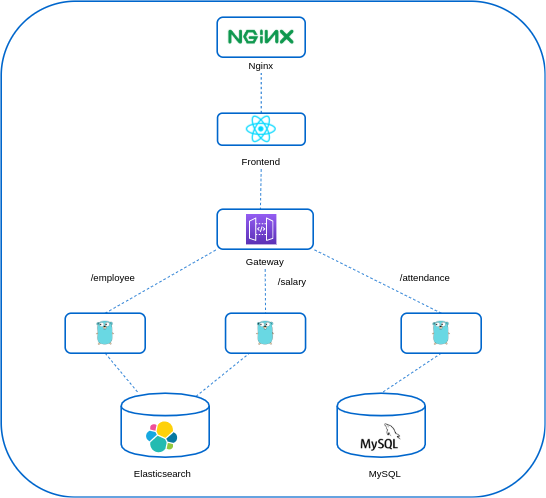

<div align="center">
  
  <h1>OT-Microservices</h1>
</div>

A loaded microservice applications for doing different kinds of POC. This is a sample Employee System which is designed to understand the microservices nature and behaviour.

## Purpose

The purpose of creating this application is to provide an individual, a holistic idea of microservice architecture, it's working, and its setup.

## Applications

These are few microservices which are getting used in this complete project.

- [attendance](./attendance) => Attendance is a microservice which is designed in Golang to manage employee's attendance information.
    - Port Number => 8081
    - Database => MySQL
- [employee](./employee) => Employee microservice is also designed in Golang to manage employee's information.
    - Port Number => 8083
    - Database => Elasticsearch
- [salary](./salary) => Salary is also a golang based application which creates and manages employee's salary information.
    - Port Number => 8082
    - Database => Elasticsearch
- [frontend](./frontend) => Frontend is written in ReactJS and gets served using nginx proxy, config can be found [here](./nginx)
    - Port Number => 4000
- [gateway](./gateway) => Gateway is a springboot based API gateway which manages the routing between applications.
    - Port Number => 8080
- [webserver](./webserver) => Webserver is a nginx based proxy which proxies the frontend application.
    - Port Number => 80

For further information about the component you can click on the application.

## Databases

These applications are using two kinds of databases, one is structured and other is non-structured.

- [elastic](./elastic) => Elasticsearch is being used as non-structured database which manages the employee's information and salary.
- [mysql](./mysql) => MySQL is getting used for structured database which manages the employee's attendance information.

For further information, click on the DB.

## Architecture

The architecture of the complete microservice interaction looks like this:-

<div align="center">
  
</div>

## Screenshot

<div align="center">
  
</div>

## Quickstart

The quickstart of application can be started using `docker` and `docker-compose`. We can use simple `docker-compose` command to build the images and start the setup.

```shell
# To build the all images of ot-microservices
make build-images

# To start the setup locally
make setup
```

## Release History

Please see our [CHNANGELOG.md](./CHNANGELOG.md) for details.

## Contact

If you have any suggestion or query. Contact us at

opensource@opstree.com
